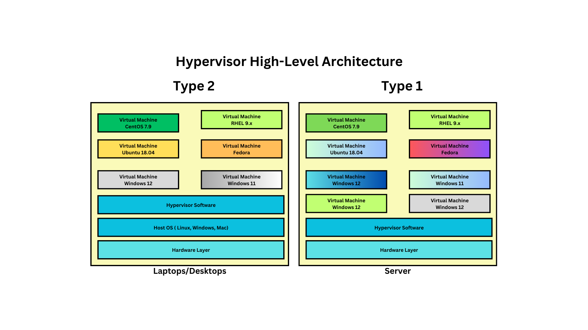
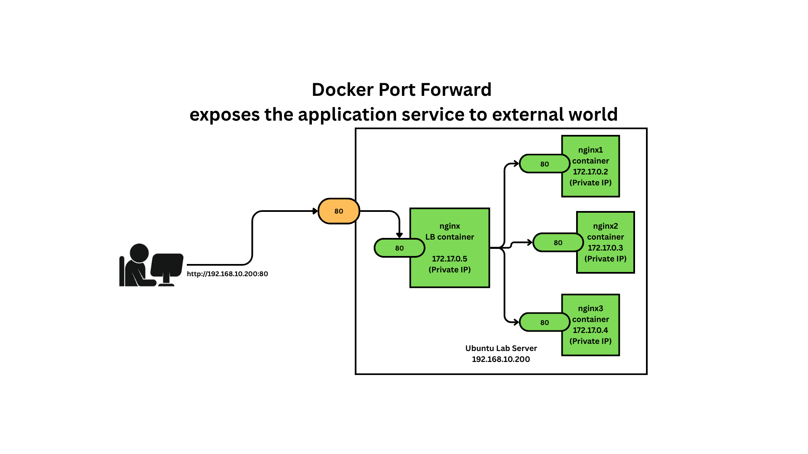

# Day 1

## Info - Boot Loaders
<pre>
- Boot Loader is a system utility that gets installed on the Sector 0, Byte 0 of your Hard Disk (MBR)
- MBR stands for Master Boot Record
- In the Master Boot Record the Boot Loader software is installed as part of your OS installation
- commonly referred as dual/multi-booting
- examples
  - LILO ( Linux Loader - almost dead and replaced by GRUB )
  - GRUB2 
  - BootCamp ( mostly in Mac Books )
- here only one OS can be active at any point of time
</pre>  

## Info - Hypervisor Overview
<pre>
- Hypervisor is nothing but virtualization technology
- with virtualization we can run multiple OS at the same time in a laptop/desktop/workstation/server
- there are two types of Hypervisors
  1. Type 1
     - this is used in Server & Workstations
     - is a.k.a bare metal Hypervisor
     - doesn't require Host OS 
     - examples
       - VMWare vSphere/vCenter
       - KVM ( opensource and supported in all Linux Distributions )
  2. Type 2
     - this is used in Laptops, Desktops & Workstations
     - this Hypervisor software is installed on top of Host OS ( Windows, Mac OS-X or Linux OS )
     - examples
       - VMWare Workstation ( Windows & Linux )
       - VMWare Fusion ( Mac OS-X )
       - Oracle VirtualBox ( Windows, Mac OS-X & Linux )
       - Microsoft Hyper-V ( Windows )
       - Parallels ( Mac OS-X )
- this type of virtualization is called heavy-weight virtualization
- the Operating System that runs within the Virtual Machine(VM) is called Guest OS
- For each VM, we need to allocated dedicated hardware resources
  - CPU Cores
  - RAM
  - Storage
- each VM represents one fully functional Operating System
- many OS can run side by side, i.e more than OS can be actively running
</pre>

## Info - Containerization
<pre>
- is an application virtualization technology
- each container represents a single application process in the OS
- contatiners don't represent an OS, they are just a single application process
- there are similarities between a virtual machine and containers
  - each container get its own IP Address just like Operating Systems get their own IP address
  - each container get its own NIC (Network Card), can have one or more network card ( software defined - virtual )
  - each container gets its own network stack ( 7 OSI Layers )
  - each container get its own file sytem
  - each containers get its own port range ( 0 to 65535 )
- it is for these reasons, people tend to compare a container with a virtual machine
- each container runs in a separate namespace
- containers are isolated from each other via namespaces (Linux kernel feature)
- we can apply resource quota restrictions by using Linux kernel feature called Control Groups ( CGroups ) 
- containers has
  - application and its dependencies
</pre>

## Info - Container Runtime Overview
<pre>
- is a low-level software that helps us manage container images and containers
- it is not user-friendly, hence normally end-users like us never use it directly
- examples
  - runC
  - cRun
  - CRI-O
</pre>

## Info - Container Engine Overview
<pre>
- is a high-level software that helps us manage container images and containers
- it is a user-friendly, end-user normally use this
- examples
  - Docker - internally depends on containerd, which in turn depends on runC
  - Podman - internally depends on CRI-O container runtime
  - Containerd - internally depends on runC container runtime
</pre>

## Info - Docker Overview
<pre>
- is a container engine developed in Go language by a company called Docker Inc
- it follows client/server architecture
- it helps run containerized application workloads
- the client tool is called docker
- the server tool is called dockerd, this runs a service with admin privilege
- wherever the Docker Server is running, it creates a local docker registry
- local docker registry
  - it is folder maintained on the system level for all users
  - in case of linux, /var/lib/docker where all docker images are maintained
- private docker registry 
  - it is server that can be setup optionally
  - generally in the industry they use Sonatype Nexus or JFrog Artifactory
  - it hosts multiple docker images
- remote docker registry ( aka Docker Hub website )
  - it hosts multiple docker images
  - it is maintained by Docker Inc with support from many opensource community contributors
- comes in 2 flavours
  1. Docker Community Edition - Docker CE ( opensource )
  2. Docker Enterprise Edition - Docker EE ( Paid Enterprise product)
</pre>

## Info - Docker Image
<pre>
- is a blueprint of a container
- it is similar to windows.iso or ubuntu.iso file
- whatever software, libraries and dependencies your application has, everything can be installed, configured in the docker image
- using docker image, mutiple containers can be created
- though some of the docker images may sound/appear like a operating system, they are not really OS
  - they just have package managers, commonly used linux tools, bash/sh terminals etc.,
</pre>

## Info - Docker Container
<pre>
- running instance of a Docker Container
- containers gets atlease one IP address and one Network card
- containers normally has their on terminal ( bash or shell )
- certain docker images also comes with pre-installed, pre-configured application ( default application that runs when containers are created )
</pre>

## Info - Hypervisor High-Level Architecture


## Info - Docker High-Level Architecture


## Demo - Installing Docker Community Edition in Ubuntu
```
# Add Docker's official GPG key:
sudo apt-get update
sudo apt-get install ca-certificates curl
sudo install -m 0755 -d /etc/apt/keyrings
sudo curl -fsSL https://download.docker.com/linux/ubuntu/gpg -o /etc/apt/keyrings/docker.asc
sudo chmod a+r /etc/apt/keyrings/docker.asc

# Add the repository to Apt sources:
echo \
  "deb [arch=$(dpkg --print-architecture) signed-by=/etc/apt/keyrings/docker.asc] https://download.docker.com/linux/ubuntu \
  $(. /etc/os-release && echo "${UBUNTU_CODENAME:-$VERSION_CODENAME}") stable" | \
  sudo tee /etc/apt/sources.list.d/docker.list > /dev/null

sudo apt-get update

sudo apt-get install docker-ce docker-ce-cli containerd.io docker-buildx-plugin docker-compose-plugin -y

sudo systemctl enable docker
sudo systemctl start docker
sudo systemctl status docker

sudo usermod -aG docker $USER
docker --version
docker images
```

## Lab - Checking the docker version
```
docker --version
docker info
```


## Lab - Listing docker images from your local docker registry
```
docker images
```


Troubleshooting permission denied error, when it prompts for password type palmeto@123
```
id
su <your-user-name>
id
docker images
```

## Lab - Download docker image from Docker Hub Remote Registry
```
docker images
docker pull ubuntu:latest
docker images
```


## Lab - Deleting a docker image from Docker Local Registry ( var/lib/docker )
```
docker images | grep hello-world
docker rmi hello-world:latest
docker images | grep hello-world
```


## Lab - Creating a docker container in interactive(foreground) mode
```
docker run -it --name ubuntu-jegan --hostname ubuntu-jegan ubuntu:latest /bin/bash
```

<pre>
- In the above command, docker is the client tool that helps us interact with the docker server
- run - command creates a new container and starts the container
- it - interactive terminal, runs in in foreground/interactive mode
- name - name of the docker or container id, this is what docker server uses internally
- hostname - used as an alternate to IP address just like we assign a hostname for virtual machine or OS
- ubuntu:latest - this is the name docker image, latest is the tag/version of the ubuntu image
- /bin/bash - this launchest the bash shell terminal inside the container as the default application
</pre>


## Lab - List all currenly running containers
```
docker ps
```


## Lab - List all containers irrespective of whether they running, exited or just created
```
docker ps -a
```


## Lab - let's create a custom docker image

Clone this training repository
<pre>
- In the command below, we are trying to create a custom docker image
- the build commands expects us to provide a Dockerfile with instructions like
  - what is the base image we would like to use to build a custom docker image
  - RUN keyword, let's us run a ubuntu linux commands, using this we are trying install all the necessary linux
    like vim editor, ifconfig, ping, git, jdk, maven build tool etc.,
  - t switch, this tells docker server that once the image is built we want to tag the image with a friendly name called mycustom-ubuntu:1.0 
  - the dot(.) at the end of the commands, tells the path where Docker can find the Dockerfile
</pre>

```
cd ~
git clone https://github.com/tektutor/openshift-aug-2025.git
cd openshift-aug-2025
cd Day1/custom-docker-image
cat Dockerfile
docker build -t mycustom-ubuntu:1.0 .
docker images | grep mycustom
```


## Lab - Let's stop a running container
Let's create couple of ubuntu containers in the background(daemon) mode
```
docker run -dit --name ubuntu1-jegan --hostname ubuntu1-jegan ubuntu:latest ubuntu:latest /bin/bash
docker run -dit --name ubuntu2-jegan --hostname ubuntu2-jegan ubuntu:latest ubuntu:latest /bin/bash
```

List the running containers
```
docker ps
```

Stop the ubuntu1-jegan container
```
docker stop ubuntu1-jegan
```

Let's list and see if ubuntu1-jegan container is stopped
```
docker ps
```


## Lab - Let's start an exited container

List the running containers
```
docker ps
```

List all containers
```
docker ps -a
```

Start the ubuntu1-jegan container
```
docker start ubuntu1-jegan
```

Let's list and see if ubuntu1-jegan container is started
```
docker ps
```


## Lab - Finding the image details like how many layers each image has got
```
docker image inspect ubuntu:latest
cd ~/openshift-aug-2025
git pull
cd Day1/custom-docker-images
cat Dockerfile
docker build -t mycustom-ubuntu:1.0

docker image inspect ubuntu:latest
docker image inspect mycustom-ubuntu:1.0
```


## Lab - Rename a container
```
docker ps
docker rename ubuntu1-jegan c1-jegan
docker rename ubuntu2-jegan c2-jegan
docker ps
```


## Lab - Finding the IP Address of a running container
```
docker ps
```

Find the IP Address of the running container
```
docker inspect c1-jegan | grep IPA
docker inspect -f {{.NetworkSettings.IPAddress}} c2-jegan
```


## Lab - Setting up a Load Balancer with 3 web server containers 
Our lb setup is going to look as shown below 


Let's first create 3 web server container using nginx:latest docker image from Docker Hub Remote Registry
```
docker run -d --name server1 --hostname server1 nginx:latest
docker run -d --name server2 --hostname server2 nginx:latest
docker run -d --name server3 --hostname server3 nginx:latest
docker ps
```

Let's create the load balancer container
```
docker run -d --name lb --hostname lb -p 80:80 nginx:latest
docker ps
```


Let's find the location of nginx configuration file by getting inside the lb container shell
```
docker exec -it lb bash
cd /etc/nginx
cat nginx.conf
exit
```

On your local machine, copy the nginx.conf from container to your local machine
```
docker cp lb:/etc/nginx/nginx.confg .
cat nginx.conf
```

Modify the nginx.conf file as shown below
```
user  nginx;
worker_processes  auto;

error_log  /var/log/nginx/error.log notice;
pid        /run/nginx.pid;


events {
    worker_connections  1024;
}

http {
    upstream backend {
        server 172.17.0.2:80;
        server 172.17.0.3:80;
        server 172.17.0.4:80;
    }

    server {
        location / {
            proxy_pass http://backend;
        }
    }
}
```

Now, we need to copy the updated nginx.conf file from our lab machine to the lb container
```
docker cp nginx.conf lb:/etc/nginx/nginx.conf
```

Let's restart the lb container, to apply config changes
```
docker restart lb
docker ps
```

Now we need to customize the respone of server1, server2 and server3
```
echo "Server 1" > index.html
docker cp index.html server1:/usr/share/nginx/html/index.html

echo "Server 2" > index.html
docker cp index.html server2:/usr/share/nginx/html/index.html

echo "Server 3" > index.html
docker cp index.html server3:/usr/share/nginx/html/index.html
```


Now open your chrome/firefox web browser on your training machine
```
http://localhost:80
```

Each time, you refresh it supposed to forward the request to server1, server2 and server3 in the round robin fashion.


Check the logs of server1
```
docker logs server1
docker logs server2
docker logs server3
docker logs lb
```


