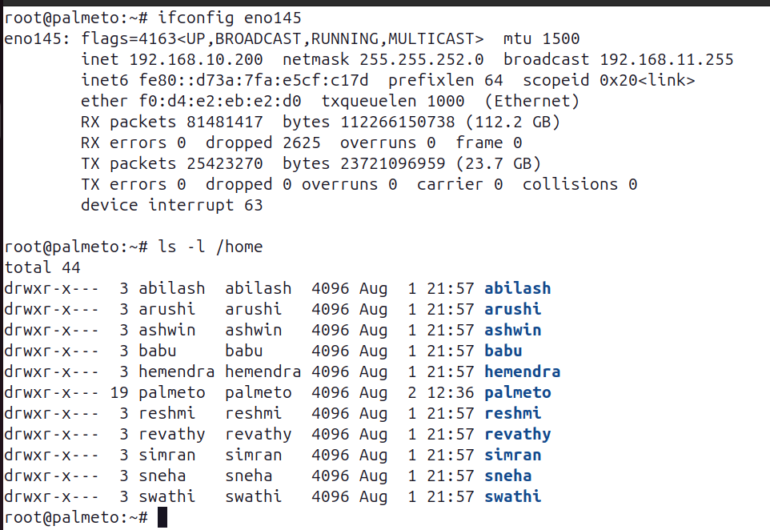
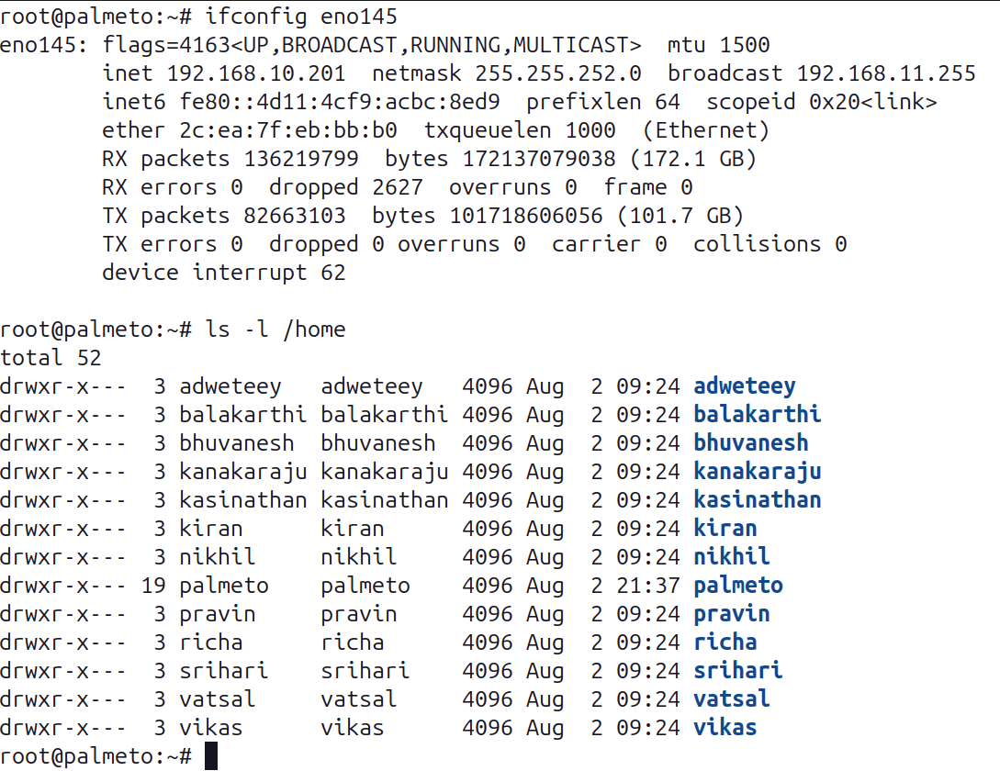

# Openshift August 2025 ( Advanced Containerization )

## Ubuntu Server 1 ( 192.168.10.200 )

## Ubuntu Server 2 ( 192.168.10.201 )

## Pre Assessment ( Kindly complete the pre-test from your Lab machine )
<pre>
https://forms.office.com/r/LrrrFxGwNp
</pre>

<pre>
- Once you complete the pre-test notify me
- Once everyone completes the pre-test we will start the training
</pre>
